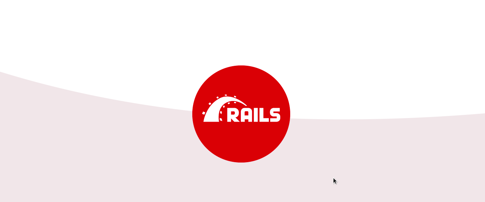

# Blog

> This is a blog app for a classic blog website with full website functinality that show the lists of posts readers can read and interracts with by adding comments and likes. Built using Ruby on Rails.

Additional description about the project and its features.



## Built With

- Major language
  - Ruby
  - Rails
  - RSpec
  - PostgreSQL
  - CSS & Sass
  - ERB

- Technologies used

```bash
- Git(version control)
```

## Getting Started

To get a local copy up and running follow these simple example steps.


### Prerequisites

- A text editor(preferably Visual Studio Code)

### Install

- [Git](https://git-scm.com/downloads)
- [Ruby](https://www.ruby-lang.org/en/downloads/)
- [PostgreSQL](https://www.postgresql.org/download/)
- [Node.js](https://nodejs.org/en/download/)
- `gem install rails`

### Usage

#### Clone this repository

```bash
git clone
$ https://github.com/netman5/blog.git
$ cd blog
```

#### Run project

```bash
- bundle install
- rails s
```

### Run Test
  
  ```bash
  - rspec spec/
  ```

## Author

👤 **Ola Ishola**

- GitHub: [@netman5](https://github.com/netman5)
- Twitter: [@Orlaish](https://twitter.com/Orlaish)
- LinkedIn: [LinkedIn](https://www.linkedin.com/in/ola-ishola/)

👤 **Meqdam Al-qudah**

- [GitHub](https://github.com/MeqdamAlqudah)
- [Twitter](https://twitter.com/MeqdamQudah)
- [LinkedIn](www.linkedin.com/in/meqdam-al-qudah-7514a21b5)

## 🤝 Contributing

Contributions, issues, and feature requests are welcome!

Feel free to check the [issues page](https://github.com/netman5/blog/issues).

## Show your support

Give a ⭐️ if you like this project!

## 📝 License

This project is [MIT](https://opensource.org/licenses/MIT) licensed.